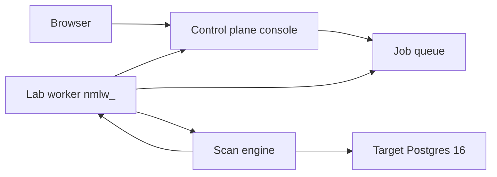

import HonestyLocks from "/snippets/honesty-locks.mdx";

<HonestyLocks />

Short map for an ISSO or reviewer. Product papers stay in portal / engine. This page does not paste those ADRs.

## Two planes

| Plane | What it owns | What it must not do |
| --- | --- | --- |
| **Control plane** (`apps/cloud`) | Identity, RBAC, vault ciphertext, job API, findings store, CKL export, waiver overlay, console | Open a session to the customer or lab DB. Call `StartScan` from Next.js. Unwrap a DSN in the browser. |
| **Scan plane** (lab-worker + `rue_scan_engine`) | DB session, check execution, report emit | Persist secrets. Import portal. Use cloud KMS / Supabase types. |

The browser never talks to the engine or the target database.

## First-scan trust boundary

1. You authenticate in the console.
2. The console queues a ScanJob (`queue=scan`, `stig-postgres-16`) and stores an opaque `credential_ref`.
3. The `nmlw_` lab-worker **pulls outbound**. It receives the ciphertext envelope, not plaintext. It unwraps JIT in memory.
4. When the image linked `StartScan`, the worker calls the engine with short-lived connect material. It never logs a DSN.
5. Findings flow worker → portal. Credentials do not.

Lab-worker tokens are org-scoped `nmlw_`. This lab installer does **not** run customer-network `nmsp_`. `nmlw_` refuses non-lab assets and RDS unwrap. Dual refuse stays.

## Vault

Today: local AES-256-GCM (`VAULT_BACKEND=local`, `VAULT_LOCAL_KEY`).

- Portal stores ciphertext + `credential_ref`.
- Session secret (`NEXTAUTH_SECRET`) and vault key are **different** material. Missing `VAULT_LOCAL_KEY` refuses wrap and unwrap in every `NODE_ENV`.
- A cloud KMS interface exists and **throws**. This product does not have a cloud KMS account. Do not invent one.
- Engine never persists target secrets.

## Fail closed (reviewer-relevant)

- **TLS** is required on customer connections by default. A lab insecure override exists as explicit debug-only; it is not the default.
- **No DSN** on argv, logs, reports, CKL host fields, or waiver justification.
- **No fake PASS.** Interview, filesystem, and unimplemented remainder rows emit `SKIPPED`, `UNABLE_TO_DETERMINE`, or `ERROR`.
- **Dedicated scan account.** Not `postgres` superuser, not `sa`, not `SYS` / `SYSTEM`.
- **CUI STIG is never allowed.** Official confidential packages are not stored or shipped. CKL export is UNCLASSIFIED.
- **Unknown / unmapped / empty pack ≠ covered ≠ PASS.** Label is STIG-mapped when mapped, never “CMMC PASS.”
- **Waiver overlay ≠ engine rewrite.** Auditor is view-only on approve.
- **Empty Findings ≠ clean** when `StartScan` is not linked.

## Roles on this path

| Role | First scan |
| --- | --- |
| Owner / Admin | Signup first user, mint `nmlw_`, vault credential, run scan, waive |
| Analyst | Run scan, waive |
| Operator | Register asset, run scan; cannot waive |
| Auditor | Read findings, download CKL / evidence / POA&M CSV; cannot run, mint, or approve |

## Postgres-first

Wave-1 ISSO demo and this documentation set are the **Postgres 16 STIG pack** through the portal. Other engine packs are not this path. Do not read this site as multi-engine coverage.

## Sources (summarized, not pasted)

- Portal install: [`LAB-INSTALL.md`](https://github.com/Nemesis-Technologies/portal/blob/e11720843762a8a7c2be7f12e31ec0b44e3c0bda/apps/self-hosted/LAB-INSTALL.md), [`HELM-INSTALL.md`](https://github.com/Nemesis-Technologies/portal/blob/e11720843762a8a7c2be7f12e31ec0b44e3c0bda/apps/self-hosted/HELM-INSTALL.md) at `e1172084`.
- CKL: [`docs/ADR-0035-ckl-portal-export.md`](https://github.com/Nemesis-Technologies/portal/blob/e11720843762a8a7c2be7f12e31ec0b44e3c0bda/docs/ADR-0035-ckl-portal-export.md).
- Waivers: [`docs/ADR-0014-poam-waiver.md`](https://github.com/Nemesis-Technologies/portal/blob/e11720843762a8a7c2be7f12e31ec0b44e3c0bda/docs/ADR-0014-poam-waiver.md).
- Classify role honesty: [`docs/runbooks/nms-classify-sample-lab-role.md`](https://github.com/Nemesis-Technologies/portal/blob/e11720843762a8a7c2be7f12e31ec0b44e3c0bda/docs/runbooks/nms-classify-sample-lab-role.md).
- Internal handbook architecture pages (`docs-internal` `architecture/planes.mdx`, `architecture/trust.mdx`) were used only as a customer-voice summary. They are not republished here.
